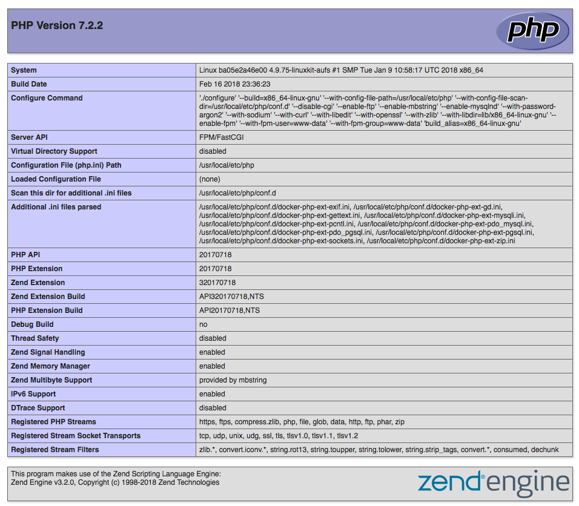

# Docker Compose for Nginx, PHP-FPM, MYSQL and Node
Docker Compose with NGINX, Node, PHP-FPM and MYSQL services

## Installation

### Clone Repository

Create an empty directory to clone the repo.

```
mkdir code && cd code
```

```
git clone https://github.com/ghazanfarmir/dockercompose-laravel-nginx.git .
```

### Environment Variables

Copy .env.example to .env and update variables per requirement

```
cp .env.example .env
```

```
# Application ENV Variables
APP_PATH=./app  # absolute path to your application
APP_PORT=9001   # host port to access application from host e.g. http://localhost:9001 

# Database ENV Variables
DB_PORT=13306   # host port to access database from host e.g. use this port to connect to database using MySQL Workbench
DB_NAME=dockerphp # database name
DB_ROOT_PASSWORD=dockerphp # root password
VERSION=1.0

# Other
DOCUMENT_ROOT=/var/www/html # path to the root within container services e.g. NGINX, PHP-FPM and Node

```

### Build Images

Inside the directory you created in above step, build images via docker-compose

```
docker-compose up -d --build
```

Once the images are created, you can list running containers as by

```
docker-compose ps
```

Open browser and hit, `http://localhost:9001` and you should see the `phpinfo()` page.

 


## Troubleshooting

 - Make sure there are no containers listening to the ports used with this setup
